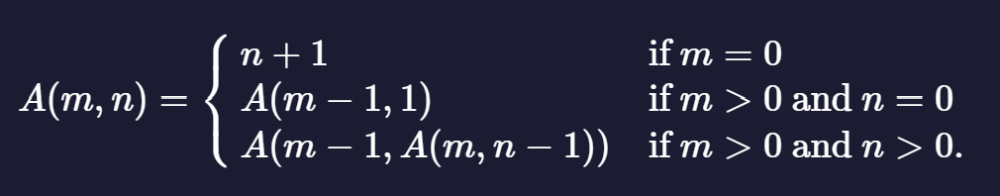

# Ackermann function

### Description

The Ackermann function is a classic example of a recursive function, notable especially because it is not a primitive recursive function. It grows very quickly in value, as does the size of its call tree.

The Ackermann function is usually defined as follows:

 

Its arguments are never negative and it always terminates.

---

Write a function which returns the value of  A(m,n). Arbitrary precision is preferred (since the function grows so quickly), but not required.

---

### Tests

1. `ack` should be a function.
2. `ack(0, 0)` should return 1.
3. `ack(1, 1)` should return 3.
4. `ack(2, 5)` should return 13.
5. `ack(3, 3)` should return 61.

### Answer:

```javascript
function ack(m, n) {
    // Base case: when m is 0
    if (m === 0) {
        return n + 1;
    }
    // Recursive cases:
    // When m > 0 and n is 0
    if (m > 0 && n === 0) {
        return ack(m - 1, 1);
    }
    // When m > 0 and n > 0
    if (m > 0 && n > 0) {
        return ack(m - 1, ack(m, n - 1));
    }
}

// Test cases
console.log(ack(0, 0)); // Should print 1
console.log(ack(1, 1)); // Should print 3
console.log(ack(2, 5)); // Should print 13
console.log(ack(3, 3)); // Should print 61

```