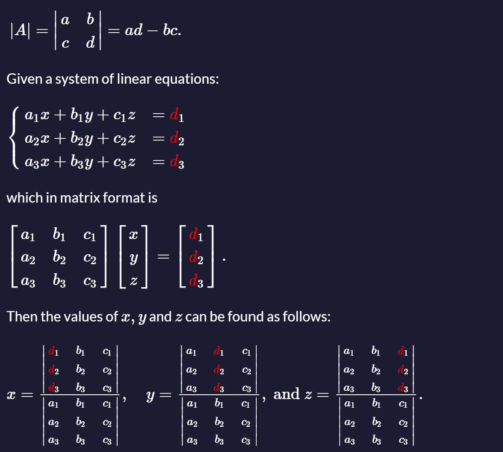

# Cramer's rule

[Cramer's rule](https://rosettacode.org/wiki/Cramer%27s_rule) is a formula for solving a system of linear equations by using the determinants of matrices formed from subsets of the coefficients and right hand side values.

The determinant of a matrix with 2 rows and two columns is given by:



---

Given the following system of equations:


solve for  w, x, y and z, using Cramer's rule.

### Tests

1. `cramersRule` should be a function.
2. `cramersRule([[2, -1, 5, 1], [3, 2, 2, -6], [1, 3, 3, -1], [5, -2, -3, 3]], [-3, -32, -47, 49])` should return `[2, -12, -4, 1]`.
3. `cramersRule([[3, 1, 1], [2, 2, 5], [1, -3, -4]], [3, -1, 2])` should return `[1, 1, -1]`.

### Answer:

```javascript
// Helper function to calculate the determinant of a 3x3 matrix
function determinant3x3(matrix) {
    const [
        [a, b, c],
        [d, e, f],
        [g, h, i]
    ] = matrix;
    return a * (e * i - f * h) - b * (d * i - f * g) + c * (d * h - e * g);
}

// Helper function to calculate the determinant of a 4x4 matrix
function determinant4x4(matrix) {
    const minorMatrix = (mat, row, col) => 
        mat.filter((_, i) => i !== row).map(row => row.filter((_, j) => j !== col));

    let det = 0;
    for (let col = 0; col < 4; col++) {
        const sign = col % 2 === 0 ? 1 : -1;
        det += sign * matrix[0][col] * determinant3x3(minorMatrix(matrix, 0, col));
    }
    return det;
}

// Main function to solve the system using Cramer's rule
function cramersRule(coeffMatrix, constants) {
    const n = coeffMatrix.length;
    const determinant = n === 3 ? determinant3x3(coeffMatrix) : determinant4x4(coeffMatrix);

    if (determinant === 0) {
        throw new Error("The system has no unique solution.");
    }

    // Function to replace a column in a matrix with the constants vector
    const replaceColumn = (matrix, colIndex, newCol) =>
        matrix.map((row, rowIndex) => row.map((value, columnIndex) => columnIndex === colIndex ? newCol[rowIndex] : value));

    // Solve for each variable
    const solutions = [];
    for (let i = 0; i < n; i++) {
        const modifiedMatrix = replaceColumn(coeffMatrix, i, constants);
        const modifiedDeterminant = n === 3 ? determinant3x3(modifiedMatrix) : determinant4x4(modifiedMatrix);
        solutions.push(modifiedDeterminant / determinant);
    }

    return solutions;
}

// Testing the function
console.log(cramersRule([[2, -1, 5, 1], [3, 2, 2, -6], [1, 3, 3, -1], [5, -2, -3, 3]], [-3, -32, -47, 49])); // Output: [2, -12, -4, 1]
console.log(cramersRule([[3, 1, 1], [2, 2, 5], [1, -3, -4]], [3, -1, 2])); // Output: [1, 1, -1]
```