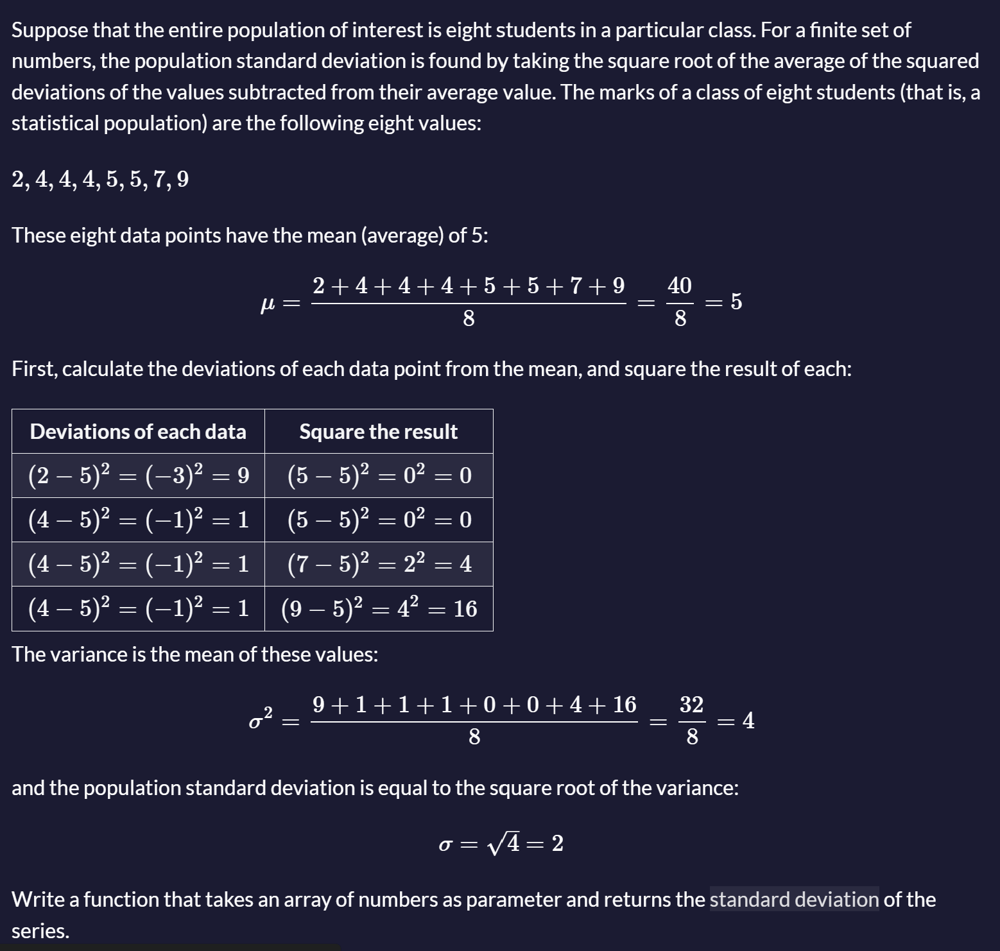

# Cumulative Standard Deviation

### Description



### Tests

1. `standardDeviation` should be a function.
2. `standardDeviation([2, 4, 4, 4, 5, 5, 7, 9])` should return a number.
3. `standardDeviation([2, 4, 4, 4, 5, 5, 7, 9])` should return `2`.
4. `standardDeviation([600, 470, 170, 430, 300])` should return `147.323`.
5. `standardDeviation([75, 83, 96, 100, 121, 125])` should return `18.239`.
6. `standardDeviation([23, 37, 45, 49, 56, 63, 63, 70, 72, 82])` should return `16.87`.
7. `standardDeviation([271, 354, 296, 301, 333, 326, 285, 298, 327, 316, 287, 314])` should return `22.631`.

### Answer:
```javascript
function standardDeviation(data) {
    // Check if data is an array and has elements
    if (!Array.isArray(data) || data.length === 0) {
        throw new Error("Input should be a non-empty array.");
    }

    // Calculate the mean (average) of the data
    const mean = data.reduce((sum, value) => sum + value, 0) / data.length;

    // Calculate the squared deviations from the mean
    const squaredDeviations = data.map(value => Math.pow(value - mean, 2));

    // Calculate the variance (mean of squared deviations)
    const variance = squaredDeviations.reduce((sum, value) => sum + value, 0) / data.length;

    // Return the standard deviation rounded to 3 decimal places
    return parseFloat(Math.sqrt(variance).toFixed(3));
}

// Example usage:
console.log(standardDeviation([2, 4, 4, 4, 5, 5, 7, 9])); // Should return 2
console.log(standardDeviation([600, 470, 170, 430, 300])); // Should return 147.323
console.log(standardDeviation([75, 83, 96, 100, 121, 125])); // Should return 18.239
console.log(standardDeviation([23, 37, 45, 49, 56, 63, 63, 70, 72, 82])); // Should return 16.87
console.log(standardDeviation([271, 354, 296, 301, 333, 326, 285, 298, 327, 316, 287, 314])); // Should return 22.631
```