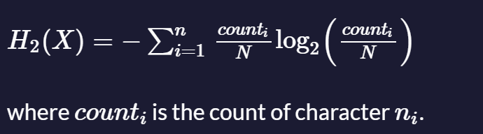

# Entropy

### Description

Calculate the Shannon entropy H of a given input string.

Given the discrete random variable *X* that is a string of *N* "symbols" (total characters) consisting of *n* different characters (n=2 for binary), the Shannon entropy of X in bits/symbol is:



---

### Tests

1. `entropy` should be a function.
2. `entropy("0")` should return `0`
3. `entropy("01")` should return `1`
4. `entropy("0123")` should return `2`
5. `entropy("01234567")` should return `3`
6. `entropy("0123456789abcdef")` should return `4`
7. `entropy("1223334444")` should return `1.8464393446710154`

### Answer:

```javascript
function entropy(input) {
    // Count the frequency of each character
    const frequency = {};
    const length = input.length;

    for (let char of input) {
        if (frequency[char]) {
            frequency[char]++;
        } else {
            frequency[char] = 1;
        }
    }

    // Calculate the Shannon entropy
    let H = 0;

    for (let count of Object.values(frequency)) {
        const probability = count / length;
        H -= probability * Math.log2(probability);
    }

    return H;
}

// Test cases
console.log(entropy("0"));                   // Should return 0
console.log(entropy("01"));                  // Should return 1
console.log(entropy("0123"));                // Should return 2
console.log(entropy("01234567"));            // Should return 3
console.log(entropy("0123456789abcdef"));    // Should return 4
console.log(entropy("1223334444"));          // Should return approximately 1.8464393446710154
```