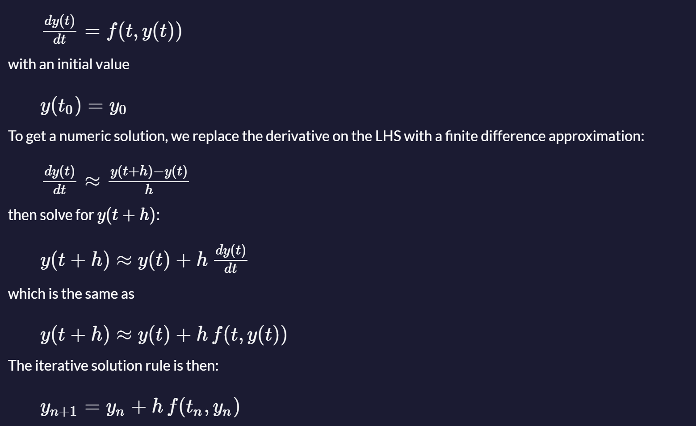
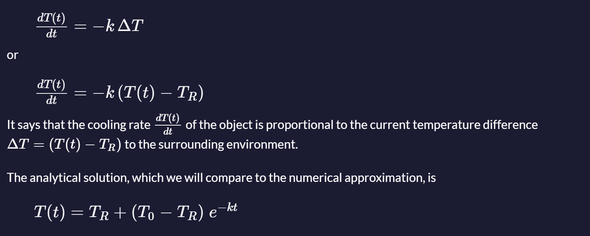

# Euler method

### Description

Euler's method numerically approximates solutions of first-order ordinary differential equations (ODEs) with a given initial value. It is an explicit method for solving initial value problems (IVPs), as described in [this article](https://www.freecodecamp.org/news/eulers-method-explained-with-examples/).

The ODE has to be provided in the following form:



where h is the step size, the most relevant parameter for accuracy of the solution. A smaller step size increases accuracy but also the computation cost, so it has always has to be hand-picked according to the problem at hand.

**Example: Newton's Cooling Law**

Newton's cooling law describes how an object of initial temperature T(t<sub>0</sub>) = T<sub>0</sub> cools down in an environment of temperature T<sub>R</sub> :



---

Implement a routine of Euler's method and then use it to solve the given example of Newton's cooling law for three different step sizes of:

- `2 s`
- `5 s` and
- `10 s`

and compare with the analytical solution.

Initial values:

- initial temperature  T<sub>0</sub> shall be `100 °C`
- room temperature T<sub>R</sub> shall be` 20 °C`
- cooling constant *k* shall be `0.07`
- time interval to calculate shall be from `0 s` to `100 s`

First parameter to the function is initial time, second parameter is initial temperature, third parameter is elapsed time and fourth parameter is step size.

---

### Tests

1. `eulersMethod` should be a function.
2. `eulersMethod(0, 100, 100, 2)` should return a number.
3. `eulersMethod(0, 100, 100, 2)` should return 20.0424631833732.
4. `eulersMethod(0, 100, 100, 5)` should return 20.01449963666907.
5. `eulersMethod(0, 100, 100, 10)` should return 20.000472392.


### Answer:

```javascript
function eulersMethod(t0, T0, elapsedTime, h) {
    // Constants for the problem
    const TR = 20; // Room temperature
    const k = 0.07; // Cooling constant
    
    // Number of steps to perform
    const steps = Math.floor(elapsedTime / h);
    
    // Initialize current temperature and time
    let currentTime = t0;
    let currentTemperature = T0;
    
    // Iterative Euler's method to approximate the temperature
    for (let i = 0; i < steps; i++) {
        // Calculate the temperature rate of change using Newton's Cooling Law
        const dTdt = -k * (currentTemperature - TR);
        
        // Euler's method update rule
        currentTemperature = currentTemperature + h * dTdt;
        currentTime += h;
    }
    
    return currentTemperature;
}

// Test cases
console.log(eulersMethod(0, 100, 100, 2));  // Expected output: 20.0424631833732
console.log(eulersMethod(0, 100, 100, 5));  // Expected output: 20.01449963666907
console.log(eulersMethod(0, 100, 100, 10)); // Expected output: 20.000472392
```