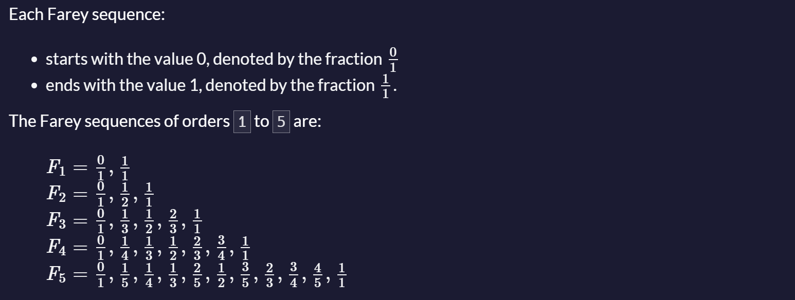

# Farey sequence

### Description

The Farey sequence F<sub>n</sub> of order `n` is the sequence of completely reduced fractions between `0` and `1` which, when in lowest terms, have denominators less than or equal to `n`, arranged in order of increasing size.

The *Farey sequence* is sometimes incorrectly called a *Farey series*.



---

Write a function that returns the Farey sequence of order `n`. The function should have one parameter that is `n`. It should return the sequence as an array.

---

### Tests

1. `farey` should be a function.
2. `farey(3)` should return an array
3. `farey(3)` should return `['0/1','1/3','1/2','2/3','1/1']`
4. `farey(4)` should return `['0/1','1/4','1/3','1/2','2/3','3/4','1/1']`
5. `farey(5)` should return `['0/1','1/5','1/4','1/3','2/5','1/2','3/5','2/3','3/4','4/5','1/1']`

### Answer:
```javascript
function gcd(a, b) {
    // Helper function to compute the greatest common divisor
    while (b !== 0) {
        const temp = b;
        b = a % b;
        a = temp;
    }
    return a;
}

function farey(n) {
    const fractions = [];
    
    // Generate fractions
    for (let b = 1; b <= n; b++) {
        for (let a = 0; a <= b; a++) {
            if (gcd(a, b) === 1) {  // Check if the fraction is in lowest terms
                fractions.push([a, b]);
            }
        }
    }

    // Sort fractions based on their decimal value
    fractions.sort((x, y) => x[0] / x[1] - y[0] / y[1]);
    
    // Format the output
    return fractions.map(fraction => `${fraction[0]}/${fraction[1]}`);
}

// Test cases
console.log(farey(3));  // Should return ['0/1', '1/3', '1/2', '2/3', '1/1']
console.log(farey(4));  // Should return ['0/1', '1/4', '1/3', '1/2', '2/3', '3/4', '1/1']
console.log(farey(5));  // Should return ['0/1', '1/5', '1/4', '1/3', '2/5', '1/2', '3/5', '2/3', '3/4', '4/5', '1/1']
```