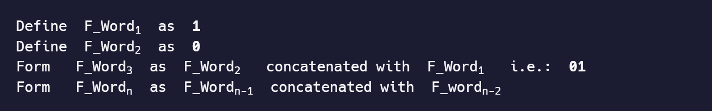

# Fibonacci word

The Fibonacci Word Sequence may be created in a manner analogous to the Fibonacci Sequence, but it focuses on iterating concatenation.



Entropy calculation is required in this challenge, [as shown in this Rosetta Code challenge](https://www.freecodecamp.org/learn/coding-interview-prep/rosetta-code/entropy)

---

Write a function to return the first `n` Fibonacci Words. The number of `n` is provided as a parameter to the function. The function should return an array of objects. The objects should be of the form: `{ N: 1, Length: 1, Entropy: 0, Word: '1' }`. `Entropy` is computed for the string `Word` and rounded to 8 decimal digits of accuracy. Note that the indices of this sequence start at `1`.

--- 

### Tests

1. `fibWord` should be a function.
2. `fibWord(5)` should return an array.
3. `fibWord(5)` should return `[{ N:1, Length:1, Entropy:0, Word:"1" },{ N:2, Length:1, Entropy:0, Word:"0" },{ N:3, Length:2, Entropy:1, Word:"01" },{ N:4, Length:3, Entropy:0.91829583, Word:"010" },{ N:5, Length:5, Entropy:0.97095059, Word:"01001" }]`.
4. `fibWord(7)` should return `[{ N:1, Length:1, Entropy:0, Word:"1" },{ N:2, Length:1, Entropy:0, Word:"0" },{ N:3, Length:2, Entropy:1, Word:"01" },{ N:4, Length:3, Entropy:0.91829583, Word:"010" },{ N:5, Length:5, Entropy:0.97095059, Word:"01001" }, { N:6, Length:8, Entropy:0.954434, Word:'01001010' }, { N:7, Length:13, Entropy:0.9612366, Word:'0100101001001' }]`.

### Answer:

```javascript
function fibWord(n) {
    // Function to calculate entropy
    function calculateEntropy(word) {
        const length = word.length;
        let freq = { '0': 0, '1': 0 };
        
        // Count occurrences of '0' and '1'
        for (let char of word) {
            freq[char]++;
        }
        
        // Calculate the probabilities
        let p0 = freq['0'] / length;
        let p1 = freq['1'] / length;
        
        // Compute entropy
        let entropy = 0;
        if (p0 > 0) entropy -= p0 * Math.log2(p0);
        if (p1 > 0) entropy -= p1 * Math.log2(p1);
        
        return parseFloat(entropy.toFixed(8));
    }

    // Fibonacci Word generation
    let fibWords = ["1", "0"]; // Initial words F_Word1 and F_Word2

    for (let i = 2; i < n; i++) {
        fibWords[i] = fibWords[i - 1] + fibWords[i - 2];
    }

    // Creating the result array
    let result = fibWords.slice(0, n).map((word, index) => {
        return {
            N: index + 1,
            Length: word.length,
            Entropy: calculateEntropy(word),
            Word: word
        };
    });

    return result;
}

// Test cases
console.log(fibWord(5));
console.log(fibWord(7));
```